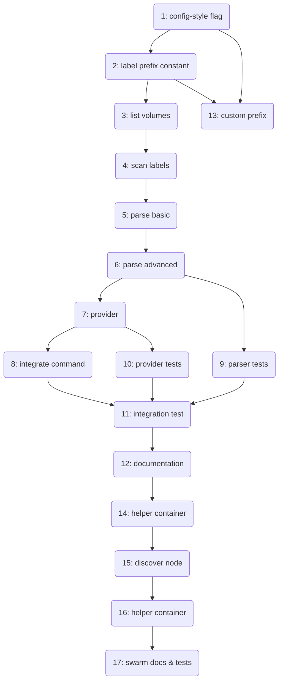

# Issue Plan: Docker-label-based configuration

This plan outlines a series of GitHub issues for adding Docker label driven configuration support. Each item is intended to be implemented in its own pull request. Lower numbered issues should be tackled first.

## Issue 1 - Add configuration style selector flag
- **Description:** Introduce a CLI flag `--config-style` allowing `envfile` (default) or `labels` to select the configuration provider.
- **Objective:** Enable switching between the existing env-file logic and future label-based mode.
- **Complexity:** S
- **Expected Result:** `docker-volume-backup --config-style=labels` starts without reading env files.
- **Advice:**
  1. Modify `cmd/backup/main.go` to define the new flag.
  2. Update calls to `command.runAsCommand` and `command.runInForeground` to forward the chosen style.
- **Labels:** enhancement, cli
- **Priority:** P1
- **Predecessor:** None

## Issue 2 - Define label namespace constant
- **Description:** Create a constant `labelPrefix = "dvbackup."` used when scanning Docker volumes for configuration labels.
- **Objective:** Central place to adjust label prefix in the future.
- **Complexity:** S
- **Expected Result:** All label handling code references this constant.
- **Advice:** Add a new file `internal/labels/labels.go` containing the constant and reference it from future code.
- **Labels:** enhancement
- **Priority:** P1
- **Predecessor:** Issue 1

## Issue 3 - List Docker volumes using the Go client
- **Description:** Build a helper that establishes a Docker client and retrieves the list of all volumes.
- **Objective:** Provide raw volume data for further label processing.
- **Complexity:** S
- **Expected Result:** Function `ListVolumes() ([]*types.Volume, error)` returns all volumes.
- **Advice:**
  1. Create `internal/labels/client.go` for Docker client helpers.
  2. Use `client.NewClientWithOpts` and `cli.VolumeList`.
- **Labels:** feature, backend
- **Priority:** P0
- **Predecessor:** Issue 2

## Issue 4 - Collect labels from volumes
- **Description:** Implement a scanner that iterates over volumes and extracts labels with the configured prefix.
- **Objective:** Produce a map `volumeName -> map[string]string` containing relevant labels for each volume.
- **Complexity:** S
- **Expected Result:** Scanner returns only labels beginning with `labelPrefix`.
- **Advice:**
  1. Add `internal/labels/scanner.go` with `ScanVolumeLabels(client) (map[string]map[string]string, error)`.
  2. Reuse the helper from Issue 3 to obtain volumes.
- **Labels:** feature, backend
- **Priority:** P0
- **Predecessor:** Issue 3

## Issue 5 - Parse basic label values
- **Description:** Parse labels for schedule, backup target and rotation values into the existing `Config` struct. Provide clear error messages for invalid formats.
- **Objective:** Convert simple label strings into configuration fields.
- **Complexity:** S
- **Expected Result:** Function `parseBasicLabels(map[string]string) (Config, error)` handles these keys.
- **Advice:**
  1. Create `internal/labels/parser_basic.go`.
  2. Reuse decoders from `cmd/backup/config.go` for cron and rotation.
- **Labels:** feature, backend
- **Priority:** P0
- **Predecessor:** Issue 4

## Issue 6 - Parse advanced label values
- **Description:** Extend parsing to support encryption settings, the `stop-during-backup` flag and notification hooks.
- **Objective:** Complete label support for all existing configuration options.
- **Complexity:** S
- **Expected Result:** `parseAdvancedLabels(map[string]string, *Config) error` fills remaining fields or returns validation errors.
- **Advice:**
  1. Create `internal/labels/parser_advanced.go`.
  2. Handle boolean, URL and list values carefully with helpful error messages.
- **Labels:** feature, backend
- **Priority:** P0
- **Predecessor:** Issue 5

## Issue 7 - Build label-based configuration provider
- **Description:** Implement a provider that scans volumes and combines parsed labels into a slice of `Config` objects.
- **Objective:** Supply configuration entirely from Docker labels.
- **Complexity:** M
- **Expected Result:** `sourceConfiguration(configStrategyLabels)` returns configs derived from labels.
- **Advice:**
  1. Add `configStrategyLabels` constant in `cmd/backup/config_provider.go`.
  2. Use the scanner and parsing helpers from Issues 4–6.
  3. Skip volumes without relevant labels.
- **Labels:** feature, backend
- **Priority:** P0
- **Predecessor:** Issues 4, 5, and 6

## Issue 8 - Integrate label strategy into command flow
- **Description:** When `--config-style=labels` is specified, ignore env files and schedule backups using the new provider.
- **Objective:** Enable running the tool solely via volume labels.
- **Complexity:** M
- **Expected Result:** Backups run based on label configuration alone.
- **Advice:**
  1. Pass the selected strategy from `cmd/backup/main.go` into `command.go`.
  2. Update help text and documentation strings as needed.
- **Labels:** feature
- **Priority:** P0
- **Predecessor:** Issues 1 and 7

## Issue 9 - Unit tests for label parsers
- **Description:** Add tests covering correct and incorrect label values for all parser functions.
- **Objective:** Ensure reliability of label decoding.
- **Complexity:** S
- **Expected Result:** `go test ./...` executes parser tests successfully.
- **Advice:**
  1. Create test files next to each parser implementation.
  2. Use sample label maps to verify success and error cases.
- **Labels:** test
- **Priority:** P1
- **Predecessor:** Issue 6

## Issue 10 - Unit tests for configuration provider
- **Description:** Test the `configStrategyLabels` provider using mocked scanner and parser results.
- **Objective:** Validate provider behaviour without hitting Docker.
- **Complexity:** S
- **Expected Result:** Provider tests run under `go test ./...`.
- **Advice:**
  1. Add tests under `cmd/backup` with fake label data.
  2. Check that volumes without labels are skipped.
- **Labels:** test
- **Priority:** P1
- **Predecessor:** Issue 7

## Issue 11 - Integration test with labeled volumes
- **Description:** Extend the integration suite with a minimal Compose setup using labeled volumes to verify end-to-end behaviour.
- **Objective:** Demonstrate real backup execution using label configuration.
- **Complexity:** M
- **Expected Result:** Integration script creates archives according to labels.
- **Advice:**
  1. Create `test/labels` with a small compose file.
  2. Update `test.sh` to run this scenario.
- **Labels:** test, integration
- **Priority:** P1
- **Predecessor:** Issues 8, 9, and 10

## Issue 12 - Document label-based configuration
- **Description:** Add a dedicated documentation page explaining label usage, available keys and examples.
- **Objective:** Make the feature discoverable and easy to adopt.
- **Complexity:** S
- **Expected Result:** New page `docs/reference/label-config.md` linked from the index.
- **Advice:**
  1. Document the default prefix and how to change it in code.
  2. Provide a small Compose snippet demonstrating labels.
- **Labels:** documentation
- **Priority:** P1
- **Predecessor:** Issues 1–11

## Issue 13 - Optional: Custom label prefix flag
- **Description:** Allow overriding the default prefix via `--label-prefix` or environment variable.
- **Objective:** Support installations requiring a different label namespace.
- **Complexity:** S
- **Expected Result:** Users can specify `--label-prefix=myapp.backup.` and labels are read accordingly.
- **Advice:** Add another flag in `cmd/backup/main.go` and propagate it to the scanner.
- **Labels:** enhancement, optional
- **Priority:** P3
- **Predecessor:** Issues 1 and 2

## Issue 14 - Run helper container for local volumes
- **Description:** When running on a single Docker host, automatically start a short-lived helper container with the target volume attached instead of requiring users to mount the volume manually.
- **Objective:** Simplify Compose setups by removing the explicit volume mount.
- **Complexity:** M
- **Expected Result:** A backup executes successfully using only the Docker socket and labels to identify volumes.
- **Advice:**
  1. Add a helper that `docker run`s the existing image with the configured volume and waits for completion.
  2. Reuse cleanup logic planned for the Swarm helper container.
- **Labels:** enhancement
- **Priority:** P2
- **Predecessor:** Issue 8

## Issue 15 - Discover Swarm node for volumes
- **Description:** When Docker runs in Swarm mode, determine the node owning each labeled volume using `docker volume inspect`.
- **Objective:** Provide the information needed to back up volumes on the correct host.
- **Complexity:** M
- **Expected Result:** Helper function `volumeNodeID(name string) (string, error)` returns the Swarm node ID or empty string when not in Swarm mode.
- **Advice:** Extend the Docker client helper to read the `NodeID` field from the volume inspect output.
- **Labels:** enhancement
- **Priority:** P3
- **Predecessor:** Issue 8

## Issue 16 - Spawn helper container on volume node
- **Description:** Start a short-lived backup container on the node that owns a labeled volume based on the node ID information.
- **Objective:** Allow centrally managed backups while ensuring volumes are archived on their respective nodes.
- **Complexity:** L
- **Expected Result:** The main service creates a helper container with the appropriate Swarm constraint or remote `DOCKER_HOST` setting.
- **Advice:** Reuse `docker run` options from existing backup logic and clean up the helper container after completion.
- **Labels:** enhancement
- **Priority:** P3
- **Predecessor:** Issue 15

## Issue 17 - Document and test Swarm helper workflow
- **Description:** Update documentation and integration tests to cover the helper container approach for Swarm setups.
- **Objective:** Demonstrate how backups work across Swarm nodes and ensure reliability.
- **Complexity:** M
- **Expected Result:** `docs/how-tos/use-with-docker-swarm.md` explains the helper mechanism and integration tests exercise it.
- **Advice:** Add a new test scenario under `test/swarm` orchestrating multiple nodes with a labeled volume.
- **Labels:** documentation, test
- **Priority:** P2
- **Predecessor:** Issue 16

